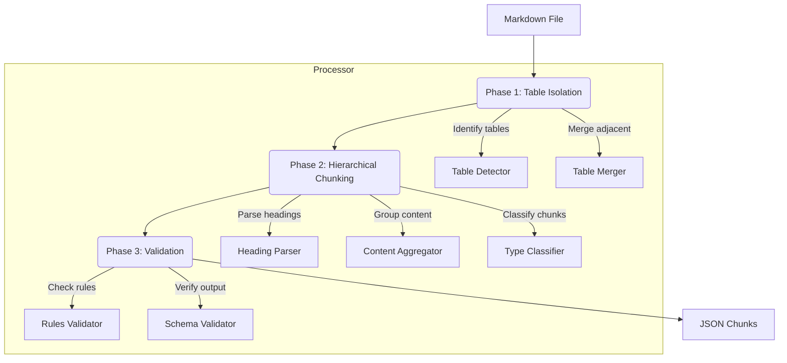

# Architecture Plan: Markdown Chunk Processor

## 1. System Architecture


## 2. File Structure Plan
```
project/
├── chunk_processor.py        # Main processor script
├── chunking/
│   ├── table_handler.py      # Table isolation/merging
│   ├── hierarchy_builder.py  # Heading hierarchy processing
│   ├── type_classifier.py    # Chunk type detection
│   └── validation.py         # Output validation
└── schemas/
    └── chunk_schema.json     # JSON schema for output validation
```

## 3. Core Algorithm Pseudocode
```python
# Phase 1: Table Isolation and Merging
def isolate_tables(content):
    tables = []
    protected_content = content
    # Find all tables using markdown table pattern
    for table in re.finditer(TABLE_PATTERN, content):
        placeholder = f"{{TABLE_{len(tables)}}}"
        protected_content = protected_content.replace(table.group(0), placeholder)
        tables.append(table.group(0))
    return protected_content, tables

# Phase 2: Hierarchical Chunking
def build_chunks(protected_content, source_file, chapter_title):
    chunks = []
    current_hierarchy = []
    current_content = []
    current_level = 0
    
    for line in protected_content.split('\n'):
        if heading_match := re.match(HEADING_PATTERN, line):
            # Save current chunk if exists
            if current_content:
                chunks.append(create_chunk(current_hierarchy, current_content, source_file, chapter_title))
                current_content = []
            
            # Update heading hierarchy
            level = len(heading_match.group(1))
            heading_text = heading_match.group(2).strip()
            
            if level > current_level:
                current_hierarchy.append(heading_text)
            else:
                current_hierarchy = current_hierarchy[:level-1] + [heading_text]
            current_level = level
        else:
            current_content.append(line)
    
    # Add final chunk
    if current_content:
        chunks.append(create_chunk(current_hierarchy, current_content, source_file, chapter_title))
    
    return chunks

# Phase 3: Validation
def validate_chunks(chunks, original_tables):
    # Check 1: No table was split
    # Check 2: Hierarchy is preserved
    # Check 3: All chunk types are valid
    # Check 4: All original tables are present in chunks
    # Check 5: Schema compliance
    ...
```

## 4. Chunk Type Classification Logic
```python
def classify_chunk(content):
    if REGISTER_DIAGRAM_PATTERN.search(content):
        return "register_diagram"
    if TABLE_PATTERN.search(content):
        return "table"
    if LIST_PATTERN.search(content):
        return "list"
    return "text"
```

## 5. Dependencies
- Python 3.8+
- Required packages:
  - `jsonschema` for output validation
  - `python-slugify` for chunk_id generation
- Input: Chapter Markdown files from `/home/dso/Renode_Peripheral_Creater/docs`
- Output: JSON chunks with specified schema

## 6. Key Implementation Details
1. **Table Handling**:
   - Use regex `r'(\|.*\|\n)(?:\| *:?[-]+:? *\|)+\n((?:\|.*\|\n?)+)'` to detect tables
   - Preserve table integrity by replacing with placeholders during processing
   - Restore tables after hierarchical chunking

2. **Register Diagram Detection**:
   ```python
   REGISTER_DIAGRAM_PATTERN = re.compile(
       r'Figure\s+\d+-\d+\..*?register', 
       re.IGNORECASE
   )
   ```

3. **Hierarchy Preservation**:
   - Track heading levels (H2, H3, etc.) to maintain parent-child relationships
   - Generate chunk_id using slugified heading hierarchy: `chapter-1_introduction`

4. **Validation Rules**:
   - No table should be split across chunks
   - All heading levels must be contiguous
   - Chunk content must be non-empty
   - All detected tables must appear in output